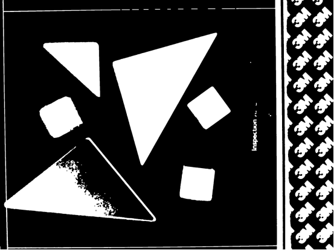
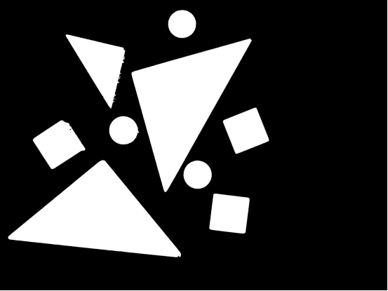
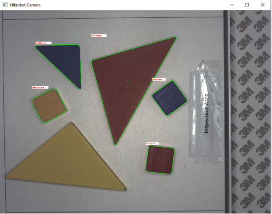
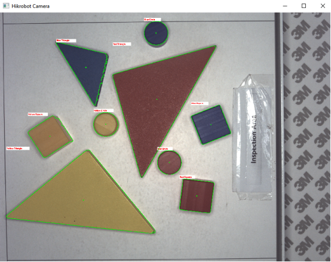
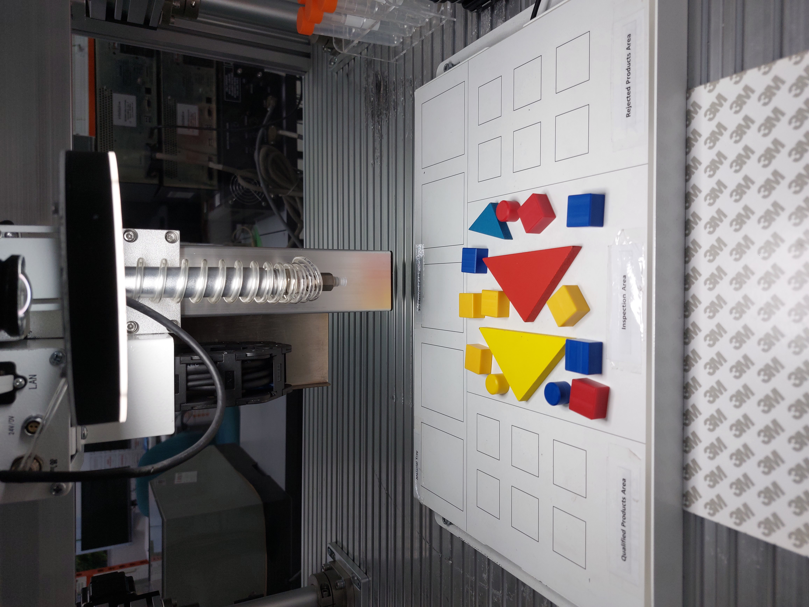
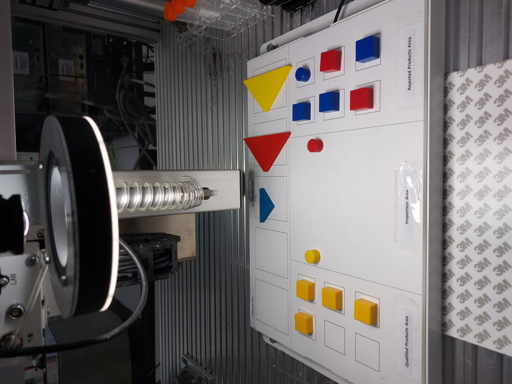
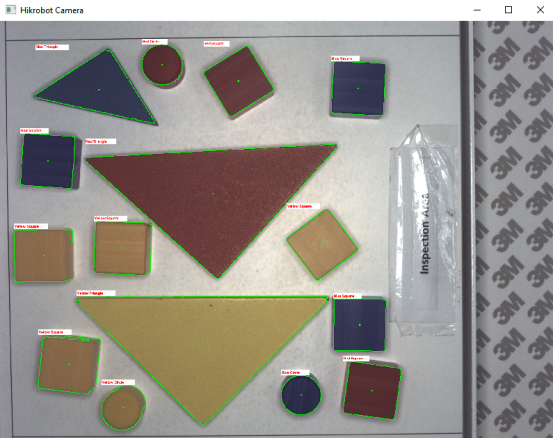
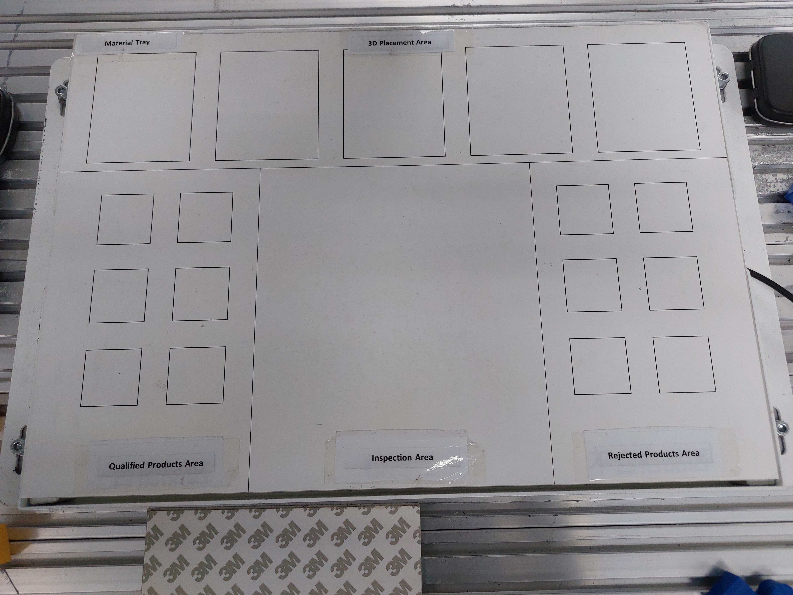

# Vision-Guided PLC Sorter

This repository contains a unified Python pipeline that completely replaces external software (like Vision Master) by combining Hikrobot camera control, OpenCV image processing, and PLC-driven robotic sorting into a single system.

<!-- 
  DEMO VIDEO
  Add a short clip (10–30s) showing: camera feed with live detection boxes,
  pressing 't' to trigger a sort, and the robot completing a pick-and-place.
  If hosted on YouTube/Drive, use a thumbnail image linking out, e.g.:
  [](https://your-video-link-here)
  If embedding a local file (GitHub supports mp4 in README via drag-and-drop upload):
  https://github.com/user-attachments/assets/REPLACE-WITH-ASSET-ID
-->
## Demo

[//]: # (<video src="docs/images/demo.mp4" controls="controls" width="100%">)


---

## Features

* **Direct Camera Integration:** Uses the Hikrobot MVS SDK to capture raw frames and converts them directly into OpenCV BGR8 format using C-memory management (`ctypes`).
* **Shape & Color Detection:** Identifies red, yellow, and blue objects using HSV color ranges, then classifies squares, circles, and triangles with contour geometry (area, perimeter, convex-hull solidity, and aspect-ratio/circularity checks).
* **Saturation-Based Thresholding:** Segments objects using the HSV saturation channel rather than plain grayscale, so light-colored or metallic/glossy objects (e.g. gold) are reliably separated from a light-colored background. See [Grayscale vs. HSV Thresholding](#grayscale-vs-hsv-thresholding) below.
* **Socket-Based PLC Control:** Communicates directly with the PLC via standard TCP sockets over the local network (IP: `192.168.6.10`, Port: `2023`).
* **Automated Pick-and-Place:** Executes hardware movements using specific string protocols (e.g., `plc,6` for readiness handshakes, and `plc,4` / `plc,5` for suction cup control).
* **Multi-Bin Sorting:** Routes objects to dedicated target, reject, and triangle bins based on shape/color rules, each using its own placement geometry.

---

## Prerequisites & Installation

To run this pipeline, you must configure both the Hikrobot drivers and your Python environment.

* The Hikrobot MVS SDK must be downloaded and installed from the official Hikrobot website.
* The `MvImport` wrapper folder (found in the SDK's `Development/Samples/Python/MvImport` directory) must be copied and placed directly next to the scripts in this repository.
* Install the required Python libraries with `pip install -r requirements.txt`.
* Ensure your PC's network adapter is on the same subnet as the PLC (e.g., `192.168.6.X`, where X is any number except 10).

---

## Project Structure

| File | Purpose |
|---|---|
| `main.py` | Live camera loop and keyboard controls (entry point). |
| `camera_io.py` | Hikrobot SDK setup and frame conversion to OpenCV BGR. |
| `vision_detection.py` | OpenCV preprocessing, shape detection, color detection, and frame annotation. |
| `calibration.py` | Pixel-to-robot coordinate transform. |
| `plc_controller.py` | PLC socket communication and robot pick/place motions. |
| `sorting.py` | Sorting decisions and target/reject orchestration. |
| `constants.py` | Camera, image-processing, color, PLC, and sorting parameters. |
| `vision_sorter_pipeline.py` | Backward-compatible wrapper for older commands/filenames. |

<!--
  ARCHITECTURE DIAGRAM (optional)
  If you want a visual module map, add it here:
  
-->

---

## Grayscale vs. HSV Thresholding

Early versions of this pipeline thresholded on the **grayscale** channel to separate objects from the background. This worked well for dark, saturated colors (red, blue) but **failed to detect light or metallic objects** — such as a gold/tan triangle — because their brightness was too close to the white background's brightness, causing the object to blend into the background mask instead of forming one solid contour.

The fix was to threshold on the **HSV saturation channel** instead. Since the background (a white/gray table) has very low saturation regardless of lighting, and every sortable object has meaningfully higher saturation than the background — even pale or glossy ones — this reliably separates object from background independent of brightness.

<!--
  COMPARISON IMAGES
  Use the SAME scene/frame for all four images so the comparison is fair:
    1. threshold_grayscale.png        — binary mask from the old grayscale method
    2. threshold_hsv_saturation.png   — binary mask from the current saturation method
    3. detection_result_grayscale.png — live overlay showing what got detected/missed (old)
    4. detection_result_hsv.png       — live overlay showing full correct detection (current)
-->

**Threshold masks** — binary output before contour/shape detection runs:

| Grayscale Threshold (old) | HSV Saturation Threshold (current) |
|---|---|
|  |  |
| Gold/tan objects blend into background; contour fragments into small noise specks | Object forms a single solid contour regardless of brightness |

**Detection results** — final labeled output on the same scene:

| Grayscale Threshold (old) | HSV Saturation Threshold (current) |
|---|---|
|  |  |
| Gold/tan triangle is missed entirely — no bounding box or label drawn | All objects, including the gold triangle, are correctly detected and labeled |

**Relevant code (`vision_detection.py`, `ObjectDetector.preprocess_frame`):**
```python
# Threshold on saturation channel instead of grayscale —
# lets us pick up light-colored (e.g. gold) objects on a light background
saturation = self.hsv[:, :, 1]
cv2.threshold(
    saturation,
    ImageProcessingConstants.THRESHOLD_VALUE,
    ImageProcessingConstants.THRESHOLD_MAX,
    cv2.THRESH_BINARY + cv2.THRESH_OTSU,
    dst=self.thresh
)
```

If you introduce new object materials/colors in the future and detection becomes unreliable again, save a snapshot (`s` key), inspect its threshold mask, and check whether saturation still cleanly separates object from background before assuming a shape/color threshold needs tuning.

---

## Hardware Calibration

Because the camera operates in pixel coordinates and the robot operates in physical millimeters, you must calibrate the system before running a live sorting sequence.

* Collect at least three known correspondences between image pixels and robot X/Y coordinates.
* Fit an affine transform with `cv2.getAffineTransform` for three points or `cv2.estimateAffine2D` for four or more points.
* Update `CalibrationConstants.PIXEL_TO_ROBOT_MATRIX` in `constants.py`.
* **SAFETY WARNING:** This script moves the real physical robot. Clear the workspace of obstructions and always keep a hand on the physical Emergency Stop (E-Stop) button.

---

## Running the Sorting Pipeline

Once calibration is complete and your matrix is hard-coded into the pipeline, you can begin sorting.

* Run `main.py` to initiate the camera connection and open the live OpenCV video feed.
* The script runs in a continuous free-run mode, drawing bounding boxes and labels on detected objects in real-time.
* To trigger the sorting routine, press the **`t`** key on your keyboard.
* Triggering the routine will freeze the live video, send the target coordinates to the PLC, execute the physical pick-and-place sequence for every detected object, and resume the video once finished.

**Keyboard Controls:**

| Key | Action |
|---|---|
| `t` | Trigger the PLC sorting sequence for currently detected objects. |
| `s` | Save a snapshot of the current video frame to your local drive. |
| `q` | Safely break the loop, release the camera hardware, close the device connection, and exit the program. |

---

## Working Area — Before / After

<!--
  BEFORE / AFTER SNAPSHOTS
  "Before" = objects scattered/unsorted in the inspection area.
  "After"  = objects placed into their respective bins post-sort.
  Use the 's' key while running main.py to capture these directly.
-->

| Before Sorting                                                  | After Sorting |
|-----------------------------------------------------------------|---|
|  |  |

<!--
  DETECTION OVERLAY EXAMPLE
  A snapshot showing the live bounding boxes/labels drawn on detected
  objects (shape + color + centroid dot) is useful for new contributors
  to see expected output at a glance.
-->

### Detection Result 



---

## Sorting Bins

Objects are routed to one of several bins based on shape and color:

| Bin | Rule | Layout |
|---|---|---|
| **Target** | Shape matches `TARGET_SHAPE` and color matches `TARGET_COLOR` (see `SortingRulesConstants` in `constants.py`) | 2×3 grid, 45mm spacing |
| **Triangle** | Any detected triangle, regardless of color | Single row, 75mm spacing |
| **Reject** | Everything else | 2×3 grid, 45mm spacing |

<!--
  BIN LAYOUT PHOTO
  A top-down photo of the physical bins with labels helps new users
  understand the physical setup without reading constants.py.
-->



---

## Troubleshooting

* **An object isn't being detected at all:** check the console for `DEBUG` output (enable by adding temporary print statements in `classify_shape()` / `classify_color()` in `vision_detection.py`) to see whether it's being dropped for area, shape, or color reasons. Save a snapshot and inspect the threshold mask if a light-colored or glossy object seems to vanish entirely.
* **`classify_shape is not defined` on another PC:** confirm you're running the split-module version and not the old monolithic script:
  ```powershell
  Select-String -Path vision_detection.py -Pattern "def classify_shape"
  ```
* **PLC connection errors:** confirm the PC's network adapter is on the `192.168.6.X` subnet and the PLC is powered on and reachable (`ping 192.168.6.10`).

---

## Notes For Other PCs

After pulling changes on another PC:
```powershell
git pull origin master
.\.venv\Scripts\python.exe -m pip install -r requirements.txt
```
